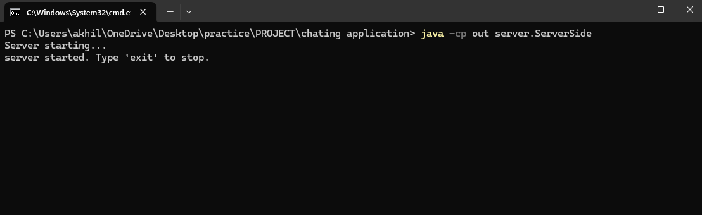
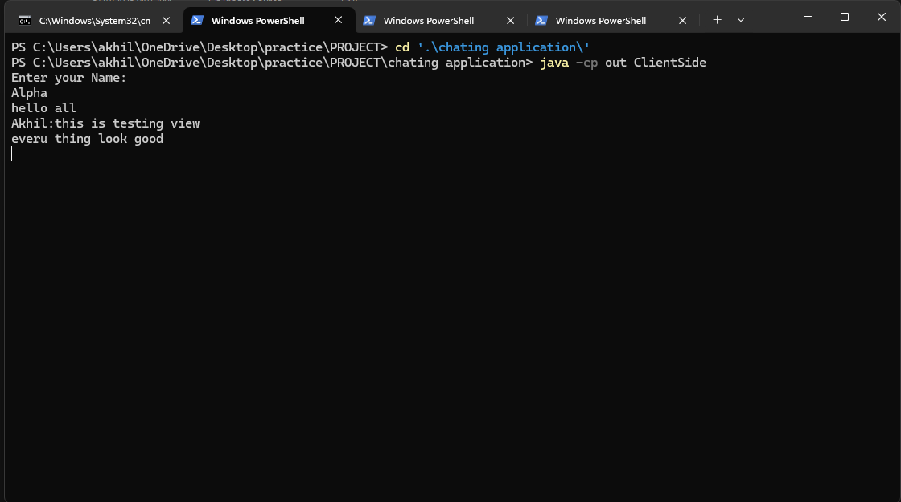

# Chating App (Java /Multi-Threading)
A simple Console base Chat application built using java sockets and threading. This app allows users to connect sever in real time  and Chat with other threads. server Braodcast the chat to every client.


## 📌 Features
- Multithreaded server to handle multiple client connections simultaneously

- Real-time message broadcasting to all connected clients

- Clean disconnection handling
  
- Easily extensible for GUI or advanced features

 ## 🛠️ Technologies Used
- Java SE (Socket Programming)

- Threads

- TCP/IP Protocol

## 📁 Project Structure
```
ChatAPP/
│
├── src/
|   ├── ServerSide/
│   |   └── ServerSide.java      # Main server class
│   └── ClientSide/
│       └── ClientSide.java      # Client-side application
│
├── README.md
└── LICENSE
```
## 🚀 How to Run
### Requirements
- Java JDK 8 or higher

- Terminal or command line

### Compiler

```
javac -d out src/server/ServerSide.java && src/client/ClientSide.java

```
Compile file and store at class folder out

### Run Server
```
java -cp src ChatServer
```



### Run Client(s)
In a new terminal window for each client:
```
java -cp src ChatClient
```


The client will prompt for a username and then allow chat communication.


### Stop Server
```
exit
```


stop accepting new client

  

  
